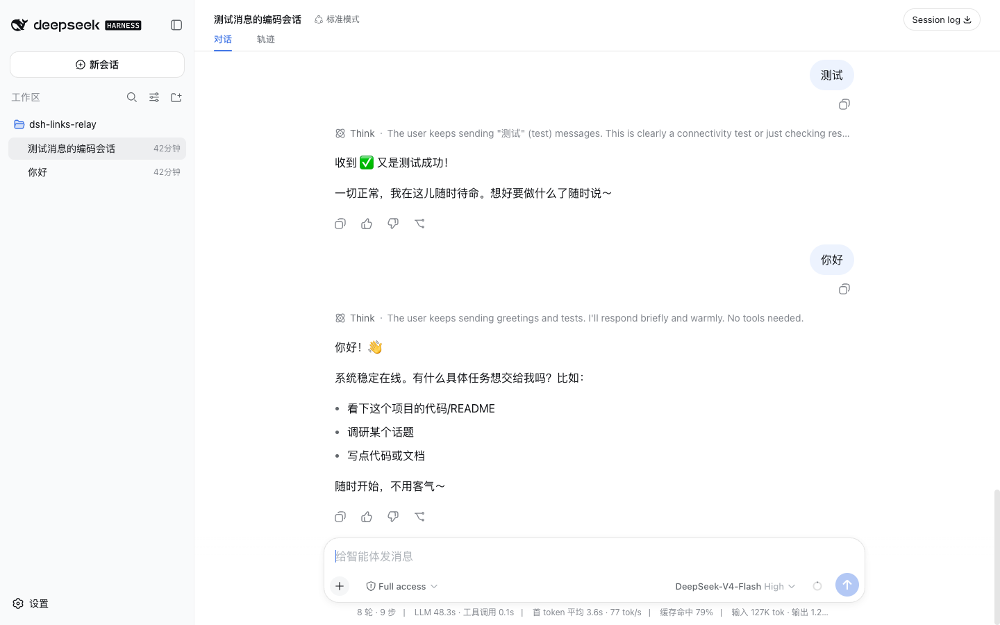
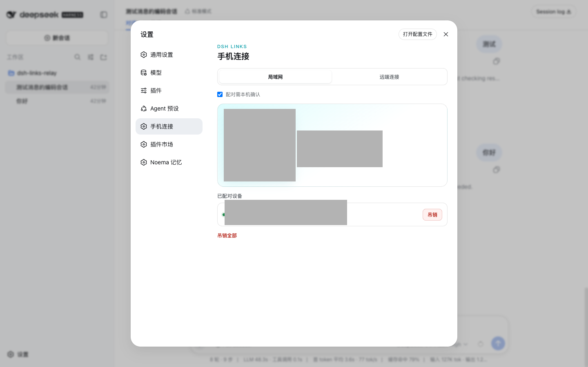
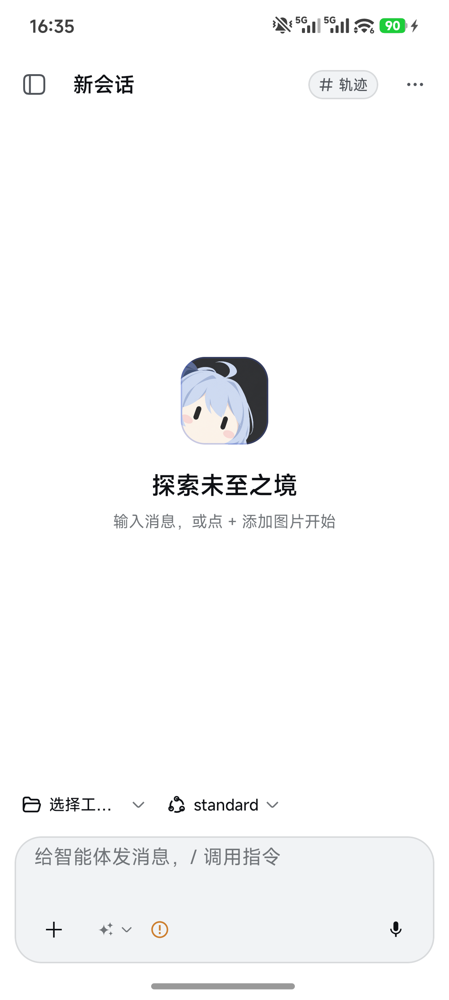
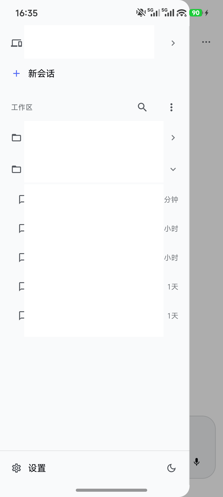
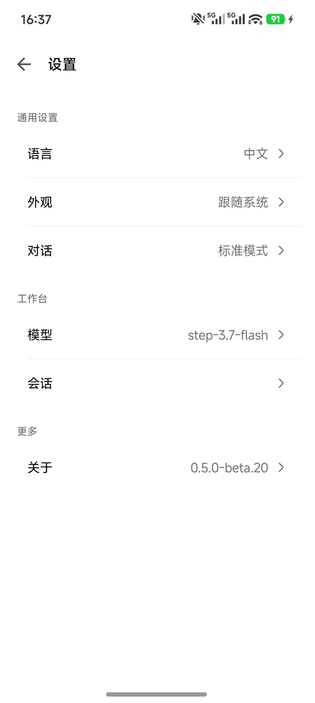

# dsh-links

<p align="center">
  <strong>把 DeepSeek Harness 带到手机上</strong><br>
  让运行在电脑、家中主机或远程服务器上的 DSH，拥有一个经过配对的原生 Android 入口。
</p>

<p align="center">
  
</p>

---

## 这是什么

DSH Links 是一个 **DSH 手机插件**，它把 Android 手机变成 DSH 的已配对客户端。电脑继续运行 DSH、工具和工作区；手机负责查看会话、发送消息、接收实时事件和处理审批。

这不是远程桌面，也不是把 DSH Web 页面塞进手机浏览器。

| 组成 | 作用 | 发布方式 |
|---|---|---|
| **本仓库 `dsh-links`** | DSH 插件、手机 HTTPS 接入代理、电脑端配对与设备管理面板；Relay 源码在 [`relay/`](relay/) | 开源 npm 插件；Relay 源码同仓公开，使用仍需维护者接入码 |
| **DSH Links Android App** | 扫码/手动配对、设备入口、原生会话工作台、实时流与审批 | 源码在 `apps/android/`；官方签名 APK 见 Releases（`app-v*`） |

---

## 核心功能

- **扫码配对**：电脑端生成二维码或 6 位配对码，手机扫码或手动输入即可完成配对。
- **设备管理**：电脑端可查看已配对设备、一键吊销全部设备；支持同名设备替换流程。
- **原生工作台**：Android App 提供原生会话列表、消息输入、思考事件查看、模型选择。
- **实时同步**：SSE 推送会话事件，断线自动重连（默认 30 秒内，不超过 5 分钟期限）。
- **审批处理**：在手机上直接处理 DSH 的审批请求，超时未处理自动标记为不可用。
- **远端 Relay（内测）**：通过维护者接入码接入 Relay，实现跨网络远程配对。

---

## 三步开始

1. **安装插件**：在运行 DSH 的电脑上安装本插件，并启动 `dsh web`。
2. **扫码配对**：打开 DSH Web 设置 →「手机连接」，扫描二维码或输入配对码。
3. **开始使用**：在 Android App 中选择已添加的 DSH，进入会话工作台。

```bash
# 安装发布版本
dsh plugin --profile web add dsh-links@<version>
dsh web

# 或开发期本地目录
dsh plugin --profile web add /path/to/dsh-links
```

> **注意**：局域网配对不需要接入码。远端 Relay 目前仅限持有维护者接入码的内测用户。

---

## 界面截图

*Android 真机截图于 2026-09-26，来自已连接的 Android 17 设备和当前源码 `0.5.0-beta.20` debug 构建。主机名、IP 地址、工作区、历史路径、二维码、配对码和设备标识均已脱敏。电脑端图片用于说明配对流程，具体文案会随 DSH Web 版本变化。*

### 电脑端手机连接



### Android 设备与配对


### 手机工作台

<table>
  <tr>
    <td width="50%"><br><sub>原生工作台：新建会话、选择工作区与模型</sub></td>
    <td width="50%"><br><sub>导航抽屉：切换设备、工作区、会话与设置</sub></td>
  </tr>
</table>

### Android 设置



---

## 安全与隐私

- 配对 Token 与 TLS 证书指纹保存在手机本地加密存储（Keystore），禁用云备份。
- App 禁用明文 HTTP，仅通过 TLS 接入。
- 卸载 App 会销毁本地设备 Token（安全语义：卸载即失效），重装需重新扫码。
- 不会在 issue、截图或 PR 中张贴接入码或 Relay 路由凭据。

完整说明见 [`PRIVACY.md`](PRIVACY.md) 与 [`SECURITY.md`](SECURITY.md)。

---

## 远端连接

公开 Beta 的正式支持范围仍是可信局域网。

- [Tailscale / Cloudflare Tunnel / DSH Links Relay 说明](REMOTE_ACCESS.md)
- 不要把 `18640` 直接做路由器端口转发。
- **DSH Links Relay 正在内测**，仅通过维护者接入码邀请加入。云端二维码内含 Relay 路由凭据（`routeSecret`），与接入码同等敏感，请勿截图分享。

---

## 开发

```bash
# 生成客户端代码
node build-client.mjs

# 运行测试
node --test test/*.mjs
```

> 修改 `src/module2.js` 后必须重新生成 `src/client.js`。

---

## 从源码构建 App

```bash
cd apps/android
./gradlew :app:assembleRelease
```

构建产物位于 `apps/android/app/build/outputs/apk/release/`。签名只在本机进行，不进入 CI。

## 官方 APK 签名证书 SHA-256 指纹

> TODO: 在 Release 时由 `apksigner verify --print-certs` 填入

---

## License

[MIT](LICENSE)。Android 客户端源码位于 [`apps/android/`](apps/android/)。第三方见 [`THIRD_PARTY_NOTICES.md`](THIRD_PARTY_NOTICES.md) 和 [`apps/android/THIRD_PARTY_NOTICES.md`](apps/android/THIRD_PARTY_NOTICES.md)。

> 代码以 MIT 许可发布。"DSH Links" 名称、logo 和应用图标不在 MIT 授权范围内；第三方 fork 请更换名称、图标和 `applicationId` 后再分发。
