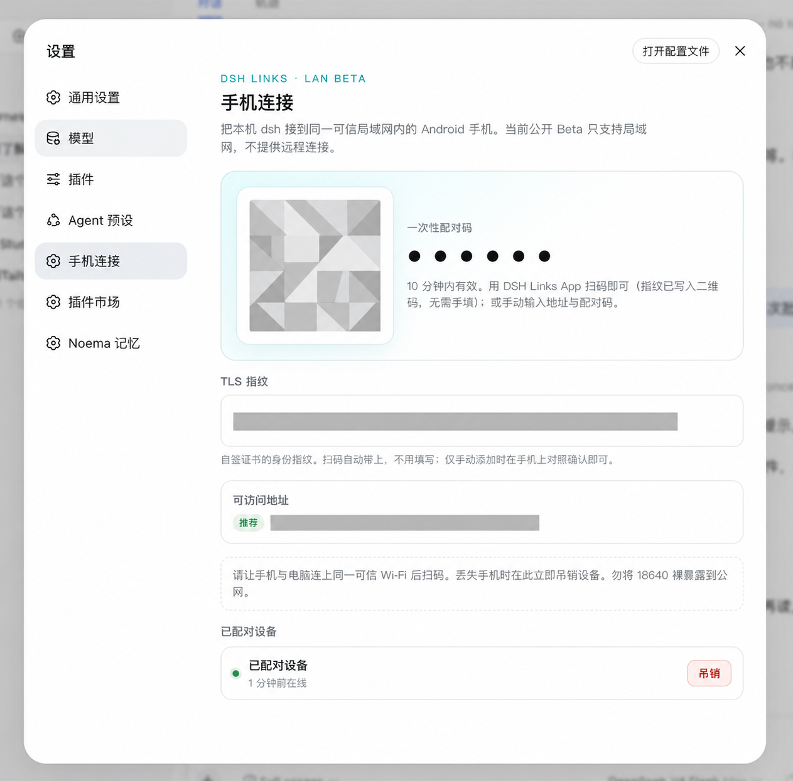
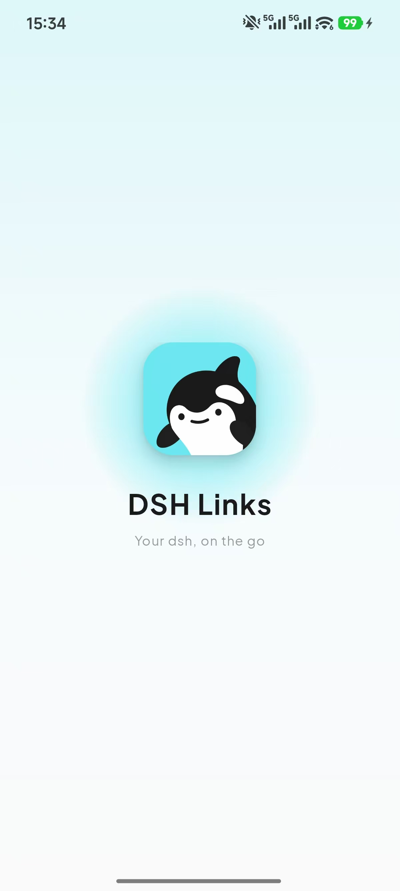
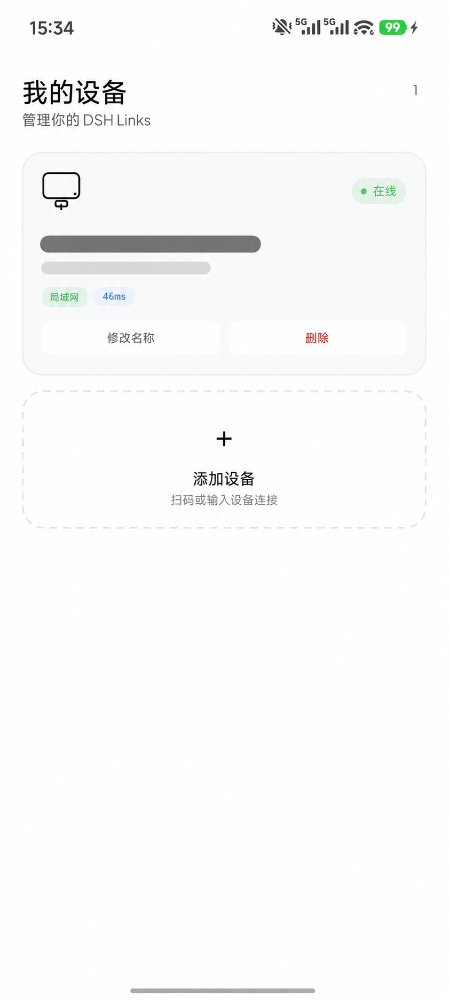
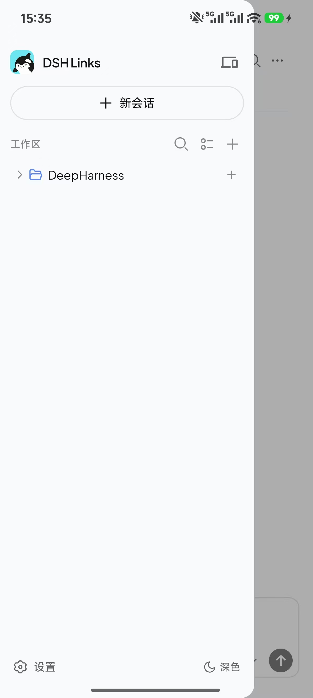
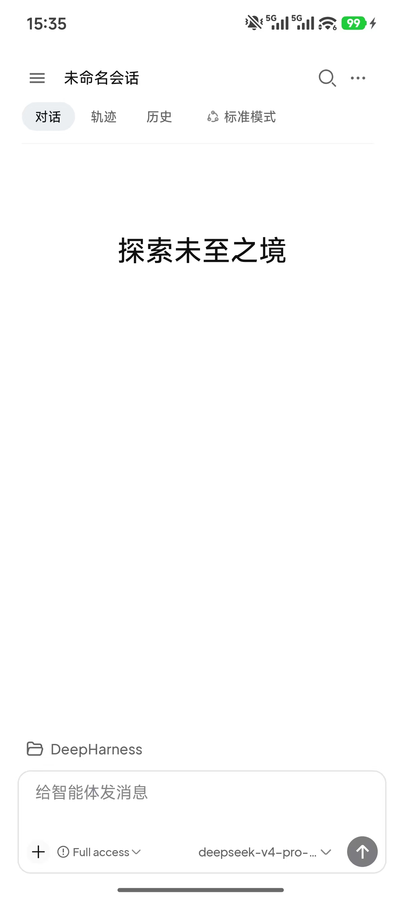
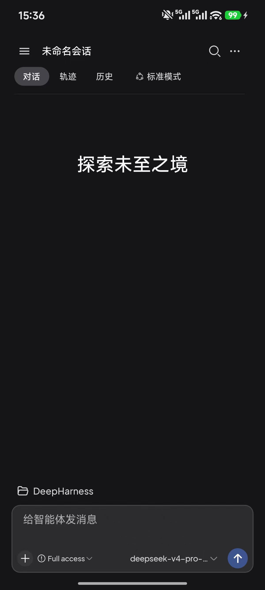
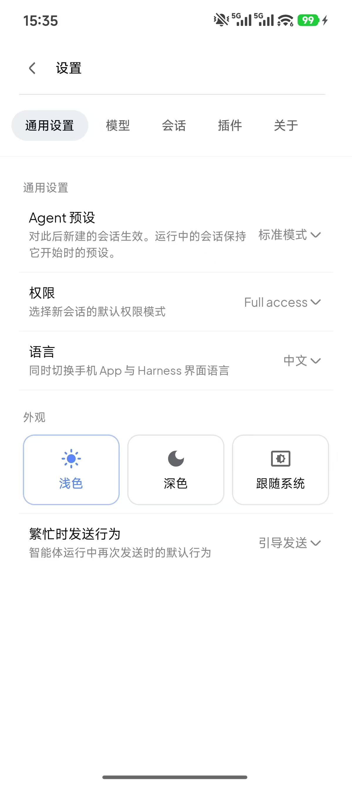
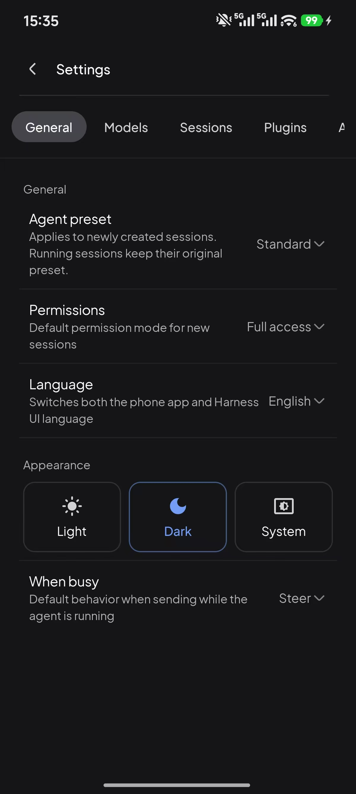
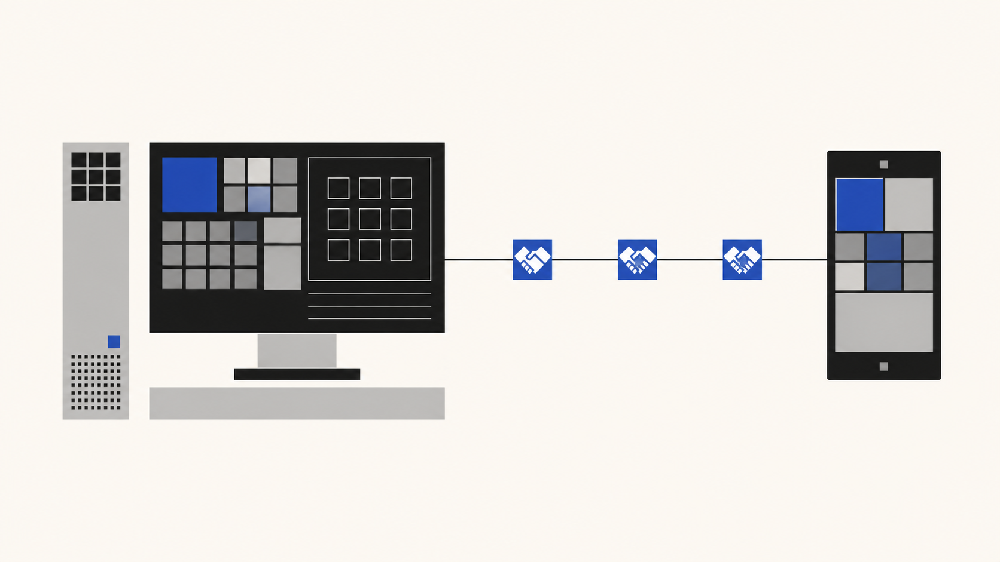

# dsh-links

DSH Links 是 [DeepSeek Harness](https://github.com/deepseek-ai) 的 Android 配套方案：让运行在电脑、家中主机或远程服务器上的 DSH，在手机上拥有一个经过配对的原生入口。

**Beta** · **Android only** · **Trusted LAN** · **Relay 内测（需接入码）** · **Unofficial**



*电脑端「手机连接」局域网标签页。截图中的二维码、配对码、证书指纹、地址和设备信息均已脱敏，不含接入码。*

## 这是什么

这不是远程桌面，也不是把 DSH Web 页面塞进手机浏览器。DSH Links 将手机作为 DSH 的一个已配对客户端：电脑继续运行 DSH、工具和工作区；Android App 负责在手机上查看会话、发送消息、接收实时事件和处理审批。

| 组成 | 作用 | 发布方式 |
|---|---|---|
| **本仓库 `dsh-links`** | DSH 插件、手机 HTTPS 接入代理、电脑端配对与设备管理面板 | 开源 npm 插件 |
| **DSH Links Android App** | 扫码/手动配对、设备入口、原生会话工作台、实时流与审批 | 私有源码；仅发布官方签名 APK |
| **DSH Links Relay** | 跨网络中继：电脑与手机均主动连接 Relay，电脑不接受公网入站 | 维护者内测中。接入码只由维护者发放；本仓库、Release 和 npm 包都不含接入码 |

## Android App 能做什么

- 扫描电脑端二维码，或手动输入地址和一次性配对码添加 DSH。
- 保存多个已配对设备，显示连接状态，并可随时移除本机记录。
- 在原生工作台中浏览会话与历史、继续对话、查看工具/思考事件，并通过 SSE 接收实时更新。
- 在手机上处理 DSH 的审批请求；丢失设备时，可从电脑端立即吊销该设备。
- 使用手机本地加密保存配对 Token 与 TLS 证书指纹；App 禁用云备份和明文 HTTP。完整说明见 [`PRIVACY.md`](PRIVACY.md)。

Android App 当前最低支持 Android 8.0（API 26）。源码不在本仓库；请只安装 GitHub Release 随版本号和 SHA-256 发布的官方签名 APK。

## 三步开始

1. 在运行 DSH 的电脑或服务器安装本插件，并启动 `dsh web`。
2. 打开「设置 → 手机连接」，使用二维码或当前 6 位配对码添加设备。
3. 在 Android App 选择已添加的 DSH，进入会话工作台；设备管理和吊销始终在电脑端可见。

局域网不需要接入码。远端 Relay 目前不是公开自助能力：只有拿到维护者发放的接入码，才能在「远端连接」里把电脑接入 Relay，并再扫第二张云端码。

## 界面预览

### 从配对到工作区

<table>
  <tr>
    <td width="33%" valign="top"><br><sub><b>启动</b>：进入 DSH Links。</sub></td>
    <td width="33%" valign="top"><br><sub><b>设备管理</b>：查看在线状态，扫码或手动添加设备。</sub></td>
    <td width="33%" valign="top"><br><sub><b>工作区</b>：新建会话、切换工作区与进入设置。</sub></td>
  </tr>
</table>

### 手机上的 DSH 工作台

<table>
  <tr>
    <td width="50%" valign="top"><br><sub><b>浅色模式</b>：继续对话、浏览轨迹和历史。</sub></td>
    <td width="50%" valign="top"><br><sub><b>深色模式</b>：同一工作台支持系统外观切换。</sub></td>
  </tr>
</table>

### 设置

<table>
  <tr>
    <td width="50%" valign="top"><br><sub><b>浅色设置</b>：调整语言、外观与会话默认行为。</sub></td>
    <td width="50%" valign="top"><br><sub><b>深色设置</b>：设置随界面主题完整适配。</sub></td>
  </tr>
</table>

*以上均为 Android App 实机截图；设备名和内网地址已脱敏。*

## Beta support boundary

This release is an **Android Beta**. The supported public path remains a trusted LAN.

- **Supported:** Android phone and DSH `0.1.0-rc.8` on the same trusted LAN.
- **Private testing:** DSH Links Relay. End-to-end remote pairing has been exercised, but it is still invite-only. Invite codes are issued only by the maintainer. This repository, GitHub Releases, and the npm package do not contain invite codes, Relay host credentials, or `state.json`.
- **Experimental, at your own risk:** a Tailscale or Cloudflare Tunnel path you operate yourself. It is not a supported Beta path and is not covered by the security or compatibility promise.
- **Not supported:** exposing port `18640` directly to the public Internet or using frp. Public self-serve Relay enrollment is not available.

The Android APK is distributed only as an official signed release. Verify the version and SHA-256 published with that release; do not install repackaged APKs. This repository contains the plugin and its documentation only; the Android source and Relay server are not included here.

## 安装

```bash
dsh plugin --profile web add dsh-links@0.1.0-beta.4
dsh web
```

开发期本地目录（本仓库根目录含 `package.json`）：

```bash
dsh plugin --profile web add /path/to/dsh-links
```

然后重启 `dsh web`，设置 →「手机连接」扫码或手动配对。扫码中的地址或手动填写的地址可以指向家中电脑或远程服务器上运行的 DSH；当前公开 Beta 正式支持同一可信局域网。跨网络可自管 Tailscale / Cloudflare Tunnel，或在持有维护者接入码的情况下使用内测 Relay。

已验证：DSH `0.1.0-rc.8` + 本插件 `0.1.0-beta.4` + Android App `0.5.0-beta.9`。

## 能力摘要

- 扫码 / 配对码 → 设备 token（`x-dsh-link-token`）
- `0.0.0.0:18640` HTTPS 手机接入代理
- `/dsh-link/mobile/*` 会话、SSE、审批、吊销
- 局域网码与云端码分开：云端码只在电脑用接入码连上 Relay 之后出现

详情见 [`SECURITY.md`](SECURITY.md)、[`PRIVACY.md`](PRIVACY.md) 与 [`REMOTE_ACCESS.md`](REMOTE_ACCESS.md)。

## 远端连接

公开 Beta 的正式支持范围仍是可信局域网。

- [Tailscale / Cloudflare Tunnel / DSH Links Relay 说明](REMOTE_ACCESS.md)
- 不要把 `18640` 直接做路由器端口转发。
- **DSH Links Relay 正在内测。** 电脑和手机都主动连接 Relay；Relay 只实时转发已配对设备的请求与响应，不持久化会话内容、文件、工作区或设备内容。没有维护者发放的接入码无法接入；请不要在 issue、截图或 PR 里张贴接入码。



## 开发

```bash
node build-client.mjs
node --test test/*.mjs
```

改 `src/module2.js` 后必须重新生成 `src/client.js`。

## License

[MIT](LICENSE)。Android 客户端不在本仓库。第三方见 [`THIRD_PARTY_NOTICES.md`](THIRD_PARTY_NOTICES.md)。
