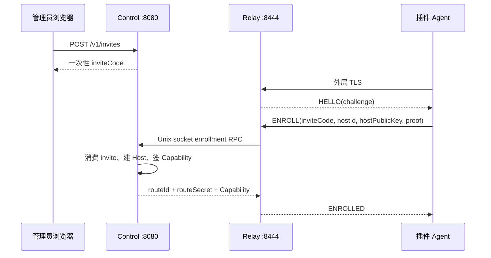
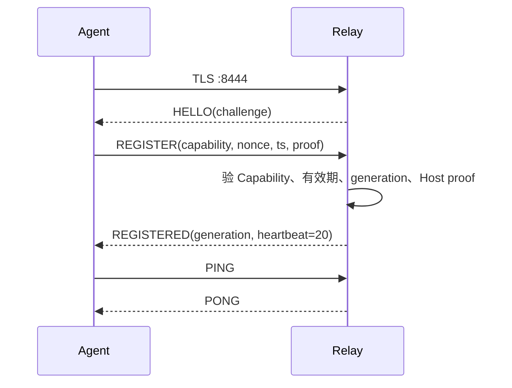
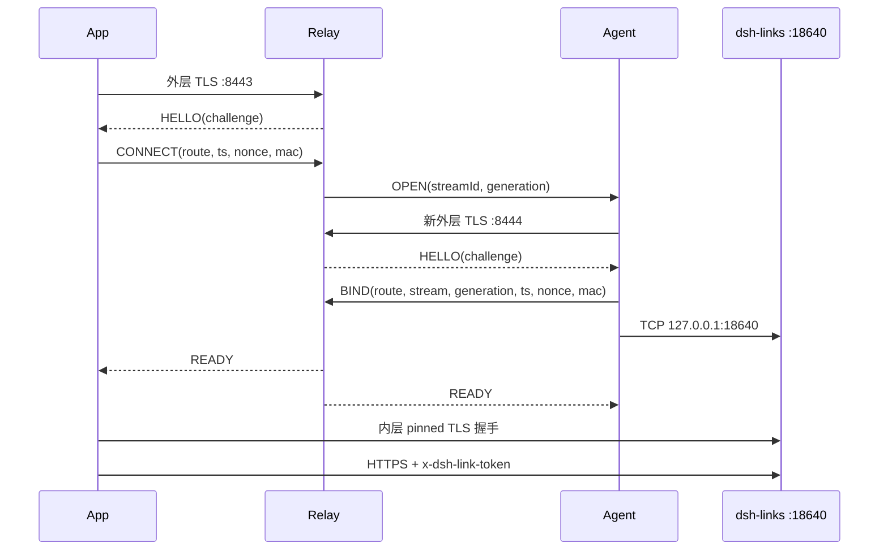

# DLR/1 协议冻结文档

> 版本：1.0  
> 日期：2026-08-21  
> 来源：`2026-08-21_DSH-Links-完全自研Relay详细方案.md` 第3–5节冻结稿  
> 目标：为 `dsh-links-relay` 提供无歧义、可测试的协议合同；所有实现与测试按本文为准

---

## 0. 跨仓一致性与 Golden Vectors

`testdata/dlr1-vectors.json` 是 DLR/1 的唯一权威、机器可读 Golden Vector
来源。公开仓插件根目录的 `testdata/dlr1-vectors.json` 与 Android App 测试资源是由该
文件同步得到的镜像，不得手工维护另一套向量。插件仓（含 `relay/`）与私有 App
仓的门禁都对解析后的 JSON 做确定性 SHA-256 校验，期望值为
`e46ddf3ebe091b544376d70cd81b0489d621d2f232fcb705e90b8e49312f7467`；在同一
工作区执行插件或 App 的检查脚本时，额外传入 Relay 文件路径即可检查跨仓
内容一致性。修改协议时必须先更新 `relay/testdata/dlr1-vectors.json`，再同步镜像、更新哈希并
让插件仓与 App 仓 CI 同时变绿。该向量只含合成测试凭据，不能用于接入任何 Relay。

---

## 1. 身份与凭据模型（第3节）

### 1.1 三种 ID 必须分开

| 名称 | 长度 | 所属对象 | 用途 |
|---|---|---|---|
| `hostId` | 128 bit | 一台运行插件的主机 | App 中稳定识别 Host；对应当前插件的主机 `state.deviceId` |
| `clientId` | 128 bit | 一台已配对手机 | 插件设备列表、Token 吊销；对应当前配对结果的设备 `deviceId` |
| `routeId` | 128 bit | 一条 Relay Host 路由 | Relay Registry 查找在线 Agent；不得当作用户身份 |

任何协议、数据库和 UI 字段不得再用含混的 `deviceId` 同时表示主机与手机。

兼容旧数据时，现有 `dsh-*` 主机字段迁移为 `hostId`；现有配对响应中的 `dev-*` 字段迁移为 `clientId`。旧版 `clientId` 可能只有 64 bit，迁移时原样保留；新签发的 `clientId` 才统一使用 128 bit，不能为了补长度让已有手机重新配对。

### 1.2 Relay 凭据

* `hostKeyPair`：插件首次启用 Relay 时生成 Ed25519 密钥对；私钥权限 `0600`
* `routeId`：Control 在 Host Enrollment 时随机生成 16 字节
* `routeSecret`：由 Control 使用服务器主密钥派生：

```text
routeSecret = HKDF-SHA256(
  ikm = routeMasterKey,
  salt = routeId,
  info = "DLR/1 route secret",
  length = 32
)
```

HKDF 遵循 RFC 5869：Extract(salt, IKM) → PRK, Expand(PRK, info, L)。`salt` 为 `routeId` 原始 16 字节，`info` 为 ASCII `"DLR/1 route secret"`。

* `Capability`：Control 使用 Issuer Ed25519 私钥签发，绑定 `hostId`、`routeId`、`hostPublicKey`、代次、并发上限和有效期
* `routeMasterKey`：32 字节随机密钥，仅允许 Control 读取，权限 `0600`，不得写入 SQLite 或日志
* `issuerPrivateKey`：只允许 Control 进程读取
* `issuerPublicKey`：Relay 数据面读取，用于验证 Capability

`routeSecret` 不保存到 SQLite。Control Enrollment 时派生并仅返回一次；Relay 收到 CONNECT/BIND 后把完整、定长的 MAC transcript 经认证 Unix IPC 交给 Control 验证，Relay 不持有主密钥。服务器更换 `routeMasterKey` 会使所有已有 Relay 配置失效，因此它必须进入加密备份。

### 1.3 Capability 格式

Capability 使用 JWS Compact Serialization，算法固定为 `EdDSA`。Header 固定包含：

```json
{"alg":"EdDSA","typ":"DLR-CAP","v":1}
```

Payload 至少包含：

```json
{
  "iss": "dsh-links-relay",
  "jti": "base64url-128bit",
  "host": "hostId",
  "route": "base64url-128bit",
  "host_pk": "base64url-ed25519-public-key",
  "generation": 1,
  "max_streams": 8,
  "iat": 1787300000,
  "exp": 1789892000
}
```

字段约束：
- `host`：UTF-8 字符串，最多 64 字节（与 `hostId` 语义一致）
- `route`：16 字节随机值 Base64URL 无填充
- `host_pk`：Ed25519 公钥 32 字节 Base64URL 无填充
- `jti`：16 字节随机值 Base64URL 无填充，唯一
- `max_streams`：1..32，默认 8
- `iat`/`exp`：Unix 秒；`exp - iat` 默认 30 天（2592000 秒）

签名验证直接针对 JWS 原始 `base64url(header).base64url(payload)` 字节，不对解析后的 JSON 重新序列化。Capability 默认有效 30 天；Agent 在剩余 7 天时通过已认证控制连接执行 `RENEW`。Host 被吊销或 generation 增加后，旧 Capability 立即失效。

### 1.4 吊销语义

必须区分三种吊销：

| 操作 | 执行方 | 立即效果 |
|---|---|---|
| 吊销手机 `clientId` | 插件 | 对应 Token 后续请求返回 401，已有 SSE 被关闭；不依赖 Relay |
| 吊销 Host Relay 路由 | Control | 关闭该 route 的 Agent 控制连接和全部 stream；新 REGISTER/CONNECT 拒绝 |
| 吊销邀请码 | Control | 未消费邀请码不能再 Enrollment；不影响已签发 Host |

V1 的 `routeSecret` 是 Host 级传输凭据，不是手机业务凭据。拿到它只能建立到插件 TLS 端口的字节通道，仍不能绕过插件 Token。Host Relay 路由吊销时立即封禁旧 route；重置后必须创建新的 `routeId`、派生新的 `routeSecret` 并提升 generation，旧 route 永久保持吊销。

---

## 2. Enrollment 与进程边界（第4节）

### 2.1 Enrollment 入口

`127.0.0.1:8080` 是管理员入口，只能通过 SSH 隧道打开。远端插件不能也不应访问它。插件 Enrollment 复用公网 Agent TLS 入口 `8444`：



邀请码为 192 bit 随机值，Base64URL 无填充，只能使用一次，默认 30 分钟过期。`ENROLL` 帧必须包含 `inviteCode`、`hostId`、`hostPublicKey`、`ts`、`nonce` 和 `proof`。`hostId` 是 UTF-8 字符串，最多 64 字节；`hostPublicKey` 解码后固定 32 字节。

Agent 的 `proof` 是 Host Ed25519 私钥对以下 transcript 的签名，证明申请者持有 Host 私钥：

```text
ASCII("DLR/1\x00ENROLL\x00") ||
SHA256(ASCII(inviteCode)) ||
U16BE(length(hostId_utf8)) || hostId_utf8 ||
hostPublicKey_raw_32 ||
BE64(ts) || nonce_raw_16 || challenge_raw_32
```

`challenge` 为该 TLS 连接上 Relay 发送的 HELLO 中的 32 字节随机值。与 REGISTER/CONNECT 不同，ENROLL 的 challenge 绑定 inviteCode 的 SHA256，防止跨连接重放。

### 2.2 两个进程如何协作

同一个 Go 二进制提供两个子命令：

```bash
dsh-links-relay control --config /etc/dsh-links-relay/config.toml
dsh-links-relay relay --config /etc/dsh-links-relay/config.toml
```

| 进程 | 持有 | 不负责 |
|---|---|---|
| `control` | SQLite、Issuer 私钥、邀请码、Host 持久状态、管理 UI/API | 不转发业务字节 |
| `relay` | 在线 Registry、stream、challenge、流量计数、Issuer 公钥 | 不读取 Control 数据库/主密钥、不解析 HTTP |

本机 Unix Socket `/run/dsh-links-relay/control.sock` 只允许两个 systemd 服务用户所属组访问，承担：

* Enrollment 与 RENEW 请求
* Host lookup 与 CONNECT/BIND route MAC 验证
* Host 吊销/generation 变更推送
* Relay 在线状态和聚合指标快照
* Control 启动后向 Relay 下发当前吊销集合

SQLite 只能由 Control 写。Relay 的在线 Registry、stream、challenge 和限流桶全部在内存中；Relay 重启后 Agent 自动重新 REGISTER。

---

## 3. DLR/1 协议（第5节）

### 3.1 帧规则

* 外层连接先完成 TLS 1.2 或 TLS 1.3 握手
* TLS 建立后 Relay 必须在 3 秒内发送 `HELLO`
* 客户端或 Agent 必须在收到 `HELLO` 后 5 秒内发送第一帧
* 帧是 UTF-8 JSON，使用单个 LF (`0x0A`) 结束；不接受 BOM、NUL 或重复 JSON key
* `routeId`、`streamId`、`nonce`、`challenge`、签名和 MAC 使用 Base64URL 无填充
* `routeId`、`streamId` 为 16 字节；nonce 为 16 字节；challenge 为 32 字节；HMAC 为 32 字节
* `ts` 是 Unix 秒整数，允许时差 ±60 秒
* `HELLO/CONNECT/BIND/READY/ERROR` 最大 768 字节；`REGISTER/ENROLL/RENEW` 最大 2048 字节
* 完成 `READY` 后不得再按行读取；解析器已缓存但尚未消费的字节必须原样交给桥接层

所有时间戳验证以 Relay 系统时间为准。帧长度指 JSON 文本（不含 LF）的 UTF-8 字节数。

帧类型与方向：

| 帧 | 方向 | 说明 |
|---|---|---|
| `HELLO` | Relay → Client/Agent | `{"type":"HELLO","v":1,"challenge":"b64u-32B","ts":...}` |
| `ENROLL` | Agent → Relay | 首次 Enrollment |
| `ENROLLED` | Relay → Agent | Enrollment 成功返回 `routeId, routeSecret, capability` |
| `REGISTER` | Agent → Relay | `{"type":"REGISTER","capability":"JWS","ts":...,"nonce":"...","proof":"..."}` |
| `REGISTERED` | Relay → Agent | `{"type":"REGISTERED","generation":1,"heartbeat":20}` |
| `CONNECT` | App → Relay | `{"type":"CONNECT","route":"...","ts":...,"nonce":"...","mac":"..."}` |
| `OPEN` | Relay → Agent | `{"type":"OPEN","stream":"...","generation":1}` |
| `BIND` | Agent → Relay | `{"type":"BIND","route":"...","stream":"...","generation":1,"ts":...,"nonce":"...","mac":"..."}` |
| `READY` | Relay → Both | `{"type":"READY","stream":"..."}` |
| `ERROR` | Relay → Client/Agent | `{"type":"ERROR","code":"...","message":"..."}` |
| `PING` / `PONG` | Agent ↔ Relay | 心跳 |
| `RENEW` / `RENEWED` | Agent ↔ Relay | Capability 续期 |

### 3.2 HMAC 规范

HMAC 输入不是 JSON 文本，而是以下长度明确的二进制字段：

```text
ASCII("DLR/1")
0x00
ASCII(op)
0x00
routeId_raw_16
streamId_raw_16_or_empty
generation_BE64_or_empty
BE64(ts)
nonce_raw_16
challenge_raw_32
```

```text
mac = HMAC-SHA256(routeSecret, transcript)
```

* `op` 为 `"CONNECT"` 或 `"BIND"` 的 ASCII
* 所有 Base64URL 字段必须先解码并验证长度，再构造 transcript
* CONNECT 的 `streamId` 和 `generation` 均为空（零长度，不写入任何字节）
* BIND 必须同时写入 `streamId_raw_16` 和 `generation_BE64`（8 字节大端）
* MAC 比较使用常量时间函数（`hmac.Equal`）

示例 transcript 构造（CONNECT）：
```
44 4C 52 2F 31 00 43 4F 4E 4E 45 43 54 00 [16B routeId] [BE64 ts][16B nonce][32B challenge]
```
BIND 额外在 routeId 后插入 16B streamId + 8B generation。

### 3.3 Agent 注册



`proof` 是 Host Ed25519 私钥对以下 transcript 的签名：

```text
ASCII("DLR/1\x00REGISTER\x00") ||
SHA256(capability_compact_bytes) ||
BE64(ts) || nonce_raw_16 || challenge_raw_32
```

* `capability_compact_bytes` 为 JWS 完整 Compact 串的 ASCII 字节（即 `header.payload.signature`）
* Relay 用 Capability 内的 `host_pk` 验证 proof
* 服务器 challenge 每条 TLS 连接随机生成，因此 Relay 重启也不会使旧 REGISTER 或 CONNECT 可重放

`REGISTERED` 响应中的 `heartbeat` 固定 20 秒，`generation` 为 Capability 中的 generation。

### 3.4 App 建立远端通道



* Relay 收到合法 CONNECT 后生成随机 `streamId`（16 字节），通过已建立的 Agent 控制连接发送 `OPEN`
* Agent 收到 `OPEN` 后必须在 10 秒内新建一条 TLS 连接并发送 `BIND`；`BIND` 的 `ts/nonce/mac` 使用该新连接的 HELLO challenge 计算
* BIND 校验通过后 Relay 向两侧发送 `READY`，随即进入字节桥接模式
* Registry 主键必须是 `routeId`，注册记录包含随机 `generation`。BIND 必须同时匹配 `routeId + streamId + generation + 当前 Agent 连接`；旧连接关闭不得删除或绑定新一代 Agent 的资源

### 3.5 超时和预算

| 项目 | V1 值 |
|---|---:|
| TLS/首帧超时 | 5 秒 |
| HELLO 发送超时 | 3 秒 |
| 心跳间隔 | 20 秒 |
| Agent 判死 | 65 秒 |
| OPEN 等待 BIND | 10 秒 |
| 每 route 活跃 stream | 8 |
| 全局活跃 stream 默认值 | 1000 |
| 每 IP 预认证 CONNECT token bucket | 容量 32，补充 30/分钟 |
| 每 route 已认证 CONNECT token bucket | 容量 96，补充 60/分钟 |
| 单方向无流量空闲超时 | 5 分钟；存在 SSE 心跳时不会触发 |
| 单次写缓冲 | 32 KiB |

握手前连接数、等待 BIND 数、活跃 stream、每 route stream、每 IP 连接和所有内部 channel 都必须设置硬上限。超过上限返回统一错误并关闭连接。

> 注：除帧长度、流数量与超时值为冻结合同外，**连接级 token bucket（每 IP / 每 route）是随容量实测可调的运维值，不属于冻结的线路协议**。当前数字对应 `internal/ingress` 的默认实现（“预认证”按源 IP、在 CONNECT MAC 验证前计；“已认证”按 route、仅在 MAC 验证通过后计），调整限量需同步改代码常量。

### 3.6 错误码

| 错误码 | 适用情况 | 是否可重试 |
|---|---|---:|
| `BAD_REQUEST` | 帧非法、字段长度错误、版本不支持 | 否 |
| `AUTH_FAILED` | Capability、proof 或 MAC 无效；路由不存在也返回此码 | 否 |
| `REPLAY_REJECTED` | 同一连接/窗口内 nonce 重复 | 否 |
| `AGENT_OFFLINE` | 合法 route 当前无 Agent | 是 |
| `ROUTE_BUSY` | route 达到 stream 上限 | 是 |
| `BIND_TIMEOUT` | Agent 未按时绑定 | 是 |
| `RATE_LIMITED` | IP 或 route 限流 | 延迟后重试 |
| `SERVER_BUSY` | 全局预算已满 | 是 |
| `REVOKED` | 已认证 Agent 的 Host 或 Capability 已吊销 | 否 |

对 App CONNECT 等未认证客户端，路由不存在、MAC 错误、Host 吊销统一返回 `AUTH_FAILED`，响应尺寸一致，不泄露 route 是否存在。`REVOKED` 只返回给已经用 Host 私钥完成认证的 Agent，或显示在管理员接口中。

---

## 4. 安全不变量（对应 §13.1）

1. Relay 不解析内层 HTTP
2. Token 只出现在内层 TLS
3. 一对 `routeSecret` 只能访问其 `routeId`
4. 旧 HELLO challenge 的 CONNECT、REGISTER、BIND 必须拒绝
5. 假 Agent 无 Host 私钥不能注册或抢占 route
6. 跨 Host、跨 generation 串线必须拒绝
7. Agent 正式构建只能连接 `127.0.0.1:18640`
8. 手机吊销由插件执行，不依赖 Relay 在线
9. Host route 吊销必须通知数据面并关闭已有连接
10. 全部队列、连接和 goroutine 有预算、超时和关闭路径
11. 日志不含原始认证帧、Secret、完整 Capability 或业务明文
12. 旧连接关闭不误删新 generation
13. 插件证书指纹不匹配必须失败，不得回退
14. 非幂等业务操作不得因 AUTO 切换而重复执行

---

## 5. 兼容与演进

* 协议版本 `v` 字段固定为 `1`；不支持的版本返回 `BAD_REQUEST`
* JWS Header `v` 独立于 DLR 帧版本，用于 Capability 结构演进
* `routeSecret` 派生 `info` 字符串固定为 `"DLR/1 route secret"`，不得随子版本改变
* 任何对 transcript 顺序或字段长度的变更必须升级 DLR 主版本并通过新的 Golden Vectors

## 6. 阶段二增补：匿名自助接入（DLR/1b）

本增补不改动既有帧与向量；新增两类帧与一个扩展语义，全部向后兼容。

### 6.1 新增帧

| 帧 | 方向 | 请求负载 | 成功响应 |
|---|---|---|---|
| `BOOTSTRAP` | App→Relay 8444 | `pubkey`(b64u 32B) `ts` `nonce`(b64u 16B) `proof`(b64u 64B) | `BOOTSTRAPPED {token}` |
| `REVOKE_SELF` | App→Relay 8444 | `routeId`(b64u 16B) `ts` `nonce` `proof` | `REVOKED {}` |

- transcript 前缀 `DLR/1\x00BOOTSTRAP\x00` / `DLR/1\x00REVOKE_SELF\x00`，其余拼接规则与 ENROLL 一致（`BuildBootstrapTranscript` / `BuildRevokeSelfTranscript`）。
- `BOOTSTRAP` 的 `proof` 证明公钥私钥持有；服务端校验 ts 窗口 ±60s、全局+按前缀限流（与 ENROLL 共用 enrollLimiter）、匿名总开关（`anonymous_enroll`）。成功后签发 JWS bootstrap token（10 分钟、`scope:bootstrap`、`sub`=公钥指纹）。
- `REVOKE_SELF` 的 `proof` 用宿主 host 私钥签名 routeId；服务端核对 route 归属后吊销该 host（幂等）。
- 两个 handler 均为每连接单帧（与 ENROLL 一致）。

### 6.2 ENROLL 扩展语义

`inviteCode` 字段现在接受两类凭证：

1. 邀请码（现状，无变化）；
2. **bootstrap token**（JWS compact，含两个点）。识别到 JWS 后服务端走匿名路径：
   - 校验 token 签名/过期/`sub` 与 `hostPublicKey` 指纹一致；
   - 设备不存在则自动登记（`devices` 表），`enabled=false` 拒绝；
   - host 配额（`anonymous_max_hosts_per_device`）在事务内复核；
   - **hostId 由服务端生成**（`h-` + 16 字节 hex），客户端提交的 hostId 仅作 proof 绑定占位；
   - Capability 有效期取 `capability_ttl`（默认 168h），MaxStreams 取 `min(default, anonymous_max_streams_per_route)`。

`ENROLLED` 响应新增 `hostId` 字段（服务端分配的实际 id），旧客户端忽略未知字段。

### 6.3 配额与封禁

- **日流量预算**：relay 每 30s 把 route 级字节/连接计数经 IPC 上报 control（`stats_report`），落入 `stats_daily`；匿名 host 当日累计（rx+tx）超过 `anonymous_daily_bytes` 后 `suspended_until` 置为次日 UTC 零点，route 立即以 revoked 语义拒绝/断开（`LookupRouteStatus`），零点后自动恢复。邀请制 host 不受此限。
- **设备封禁**：`/v1/devices/{id}/disable` 级联吊销设备全部 host 并广播；`enable` 恢复身份（旧 host 保持吊销）；`delete` 移除身份。
- **总开关**：`POST /v1/settings/anonymous` 持久化于 settings 表，重启不丢；关闭后 BOOTSTRAP 与匿名 ENROLL 一律拒绝。
- 所有按 IP 限流在本阶段起按 IPv6 `/64`（`ipv6_prefix_len`）聚合；全局预认证速率预算 + 预认证连接池上限（maxConns/4）保证洪峰不能饿死已认证流量。

### 6.4 安全不变量（增补）

1. bootstrap token 是**一次性语义**凭证：10 分钟过期，仅授权一个匿名 ENROLL，且 `sub` 与 host 公钥指纹强绑定。
2. 匿名 host 永远享有「设备级」主体责任：可封禁、可配额、可撤销、有日预算；`device_id` 空即邀请制，行为不变。
3. REVOKE_SELF 只允许撤销**自己**的 route；伪造 proof 拿不到任何信息（错误码与 ENROLL 失败一致为 AUTH_FAILED）。
4. 当前客户端不得从匿名设备 route 推断目标 Plugin route。匿名扫码恢复前，协议必须增加与目标 Host 绑定、短时且一次性的配对能力，并完成 App → Relay → Plugin 端到端验证。
